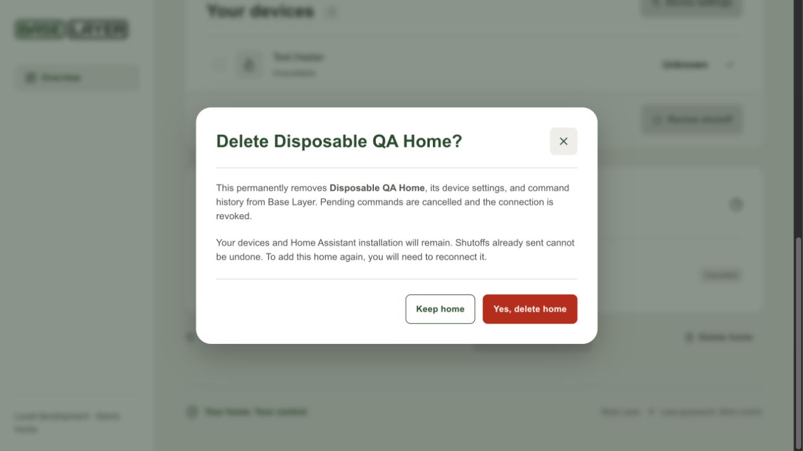
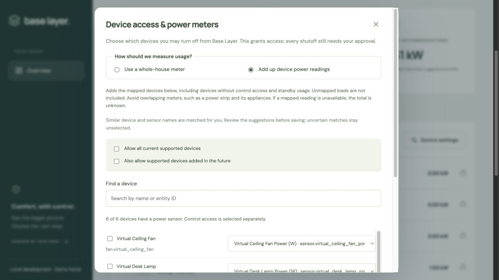
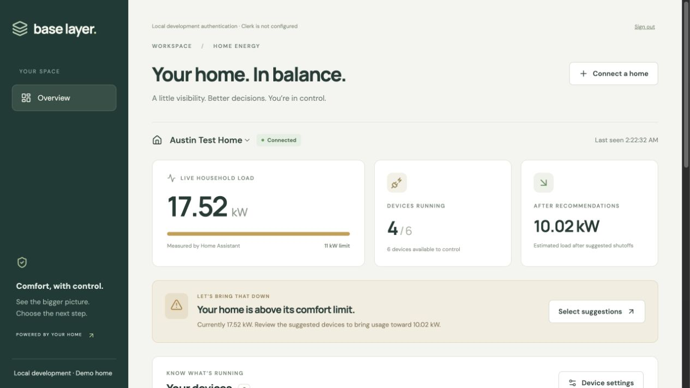
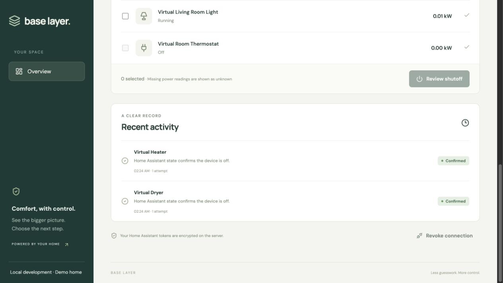

# Local verification

## Command revocation and home deletion

- Backend: 31 tests passed, including ownership checks, terminal command
  preservation, cancellation before/after an in-flight send, and cascading home
  deletion with native revocation failures.
- Frontend: confirmation must precede deletion, cancellation keeps the home,
  duplicate submission and dismissal during deletion are blocked, and only
  pending commands offer revocation.
- In an isolated UI fixture with no live credentials, revoking the command
  changed its status to Cancelled. Delete home displayed a named confirmation
  with Keep home and Yes, delete home actions.

Validated September 25, 2026 against the Home Assistant virtual house available at that time.
The fixture has since been removed along with the former plugin folder.

- Backend: 11 tests passed; build succeeded without warnings.
- Frontend: 13 tests passed; production build and formatting checks passed.
- Native Home Assistant authorization code exchange discovered six devices.
- Reusing a consumed OAuth state was rejected.
- All current devices could be allowed without allowing future devices.
- The overload scenario reached about 17.52 kW and remained on until approval.
- The dashboard recommended the dryer and heater. After explicit approval,
  both commands were confirmed from subsequent Home Assistant state readings
  on their first attempt; household demand dropped to about 10.02 kW.
- Revoking the connection prevented further commands. The virtual house was
  reset after testing and the isolated test API/frontend were stopped.
- The Clerk-configured API rejected missing and invalid user tokens.

The end-to-end device test used an isolated, loopback-only development login.
The main app renders the real Clerk sign-in screen, but signing in with the
user's Clerk account and linking their own home remains a user action.
No physical appliances were used.

## Usage-source update

- Backend: 19 tests passed, including persisted source selection and additive
  database upgrade preserving existing records.
- Frontend matching tests cover ambiguous names, duplicate sensors, preserved
  assignments, and conflicting room identifiers; settings tests cover saving
  sums independently of control permissions.
- Live UI suggested five of six virtual-device meters. The thermostat/HVAC
  pair was deliberately left for manual selection.
- After saving device-sum mode, the live API total equaled all six mapped
  readings while every device remained view-only.

